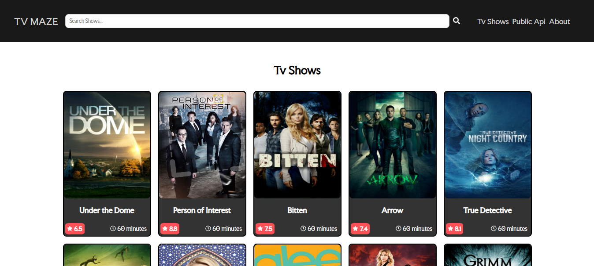
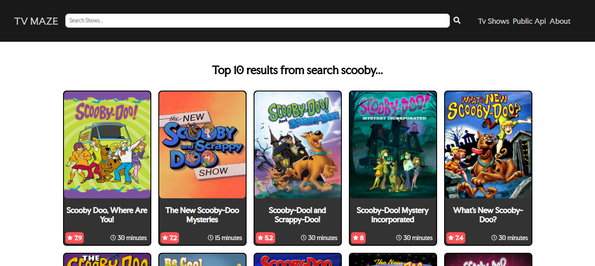
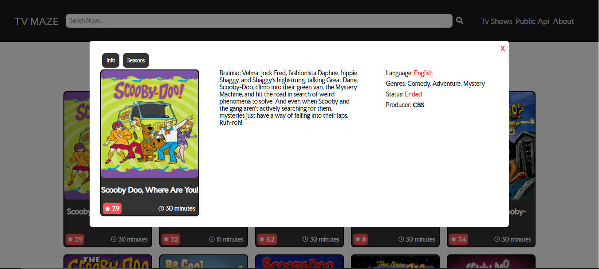
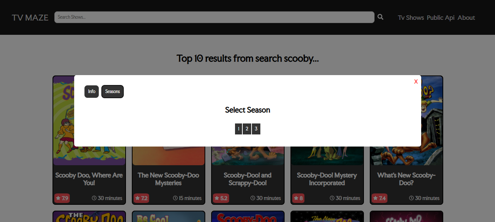
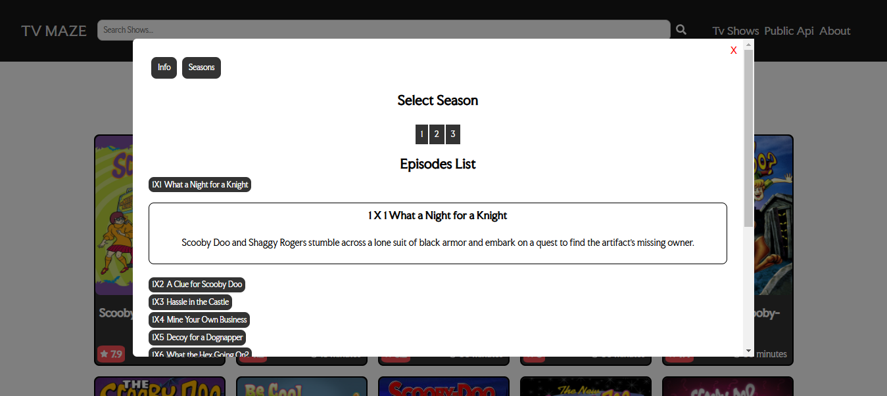

# Projeto de Consumo da API TV Maze

Este projeto em React e TypeScript consome a API pública do TVMaze para exibir informações sobre séries de TV e seus detalhes, como temporadas e episódios.

## Tela Inicial



## Tecnologias Usadas
- React
- TypeScript
- TVMaze API
- Axios
- Styled-components
- React-icons

## Funcionalidades Principais
- Listagem de todas as séries de TV disponíveis.
- Busca por séries específicas.
- Exibição de detalhes de cada série.
- Visualização das temporadas e episódios de cada série.
- Interface estilizada com **Styled-components**.

## Instalação e Configuração
1. Clone o repositório:
```
  git clone https://github.com/DiegoOtani/projeto-1-fullstack.git
```

2. Instale as dependências:
```
  npm install
```

3. Inicie o projeto:
```
  npm start
```

## Estrutura do projeto

- src/components: Componentes React
- src/contexts: Definições de estados globais da 
aplicação.
- src/Sections: Separação das sections da página.
- src/services: Funções para consumir a API do TVMaze.
- src/types: Definições de tipos TypeScript para o 
projeto.

## Exemplos de uso:

1. Visualizar todas as séries na home:


2. Procurar por séries específicas através do input no Header:


3. Ver informações sobre a série:


4. Ver temporadas da série:


5. Ver lista de episódios por temporada e informações sobre cada episódio:
